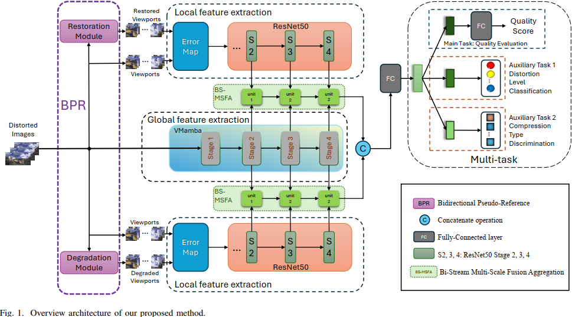

# Multi-task Guided No-Reference Omnidirectional Image Quality Assessment with Feature Interaction

[](https://opensource.org/licenses/MIT)

This repository contains a PyTorch implementation of the paper:

> **Multi-task Guided No-Reference Omnidirectional Image Quality Assessment with Feature Interaction**  
> Yun Liu, Sifan Li, Huiyu Duan, Yu Zhou, Daoxin Fan, and Guangtao Zhai

The implementation follows the paper's methodology for no-reference quality assessment of omnidirectional/360° images.



## Table of Contents
- [Overview](#overview)
- [Installation](#installation)
- [Dataset Preparation](#dataset-preparation)
- [Training](#training)
- [Evaluation](#evaluation)
- [Results](#results)
- [Configuration](#configuration)
- [Citation](#citation)

## Overview

This implementation includes all key components from the paper:
- **Bidirectional Pseudo-Reference (BPR) Module**: Extracts multi-scale local features from restoration and degradation directions
- **VMamba-based Global Feature Extractor**: Captures long-range global semantic information
- **Bi-Stream Multi-Scale Feature Aggregation (BS-MSFA)**: Dynamically fuses local and global features with residual connections
- **Multi-Task Learning Framework**: Combines quality prediction with distortion level classification and compression type discrimination

The model achieves state-of-the-art performance on both OIQA and CVIQ datasets with PLCC and SRCC > 0.8 even with limited training data.

## Installation

1. Clone the repository:
```bash
git clone this
cd mt-oiqa
```

2. Create a virtual environment (recommended):
```bash
python -m venv oiqa-env
source oiqa-env/bin/activate  # Linux/MacOS
# or 
oiqa-env\Scripts\activate    # Windows
```

3. Install dependencies:
```bash
pip install -r requirements.txt
```

## Dataset Preparation

The implementation supports two benchmark datasets:
- OIQA dataset
- CVIQ dataset

### Folder Structure
```
data/
├── CVIQ/
│   ├── Images/
│   ├── MOS.csv
│   ├── Viewports/
│   ├── RestoredViewports/
│   └── DegradedViewports/
└── OIQA/
    ├── Images/
    ├── MOS.csv
    ├── Viewports/
    ├── RestoredViewports/
    └── DegradedViewports/
```

### Data Requirements

1. **OIQA Dataset**:
   - Contains 360 omnidirectional images with various distortions
   - Each image has 20 pre-generated viewports
   - MOS.csv should include columns: `image_id`, `mos_score`, `distortion_type`, `distortion_level`, `compression_type`

2. **CVIQ Dataset**:
   - Contains 544 images (528 distorted + 16 reference)
   - Distortions include JPEG, H.264/AVC, and H.265/HEVC
   - Resolution: 4096 × 2048

### Note on Pre-Generated Viewports
The paper generates 20 viewports following [54] (Viewport-sphere-branch network). In this implementation, we assume these viewports are pre-generated and organized as shown above.

## Training

To train the model on the OIQA dataset:
```bash
python src/train.py --dataset OIQA --batch-size 16 --epochs 300
```

To train on the CVIQ dataset:
```bash
python src/train.py --dataset CVIQ --batch-size 16 --epochs 300
```

### Custom Configuration
You can override default settings with a custom configuration file:
```bash
python src/train.py --dataset OIQA --config configs/experiment_1.json
```

### Resuming Training
To resume training from a checkpoint:
```bash
python src/train.py --dataset OIQA --resume checkpoints/OIQA/best_model.pth
```

## Evaluation

To evaluate a trained model:
```bash
python src/evaluate.py --dataset OIQA --model-path checkpoints/OIQA/best_model.pth
```

The evaluation script computes the following metrics:
- PLCC (Pearson Linear Correlation Coefficient)
- SRCC (Spearman Rank Correlation Coefficient)
- RMSE (Root Mean Square Error)
- Distortion Classification Accuracy
- Compression Classification Accuracy

## Results

Our implementation achieves comparable results to those reported in the paper:

| Dataset | PLCC   | SRCC   | RMSE   |
|---------|--------|--------|--------|
| OIQA    | 0.8670 | 0.7541 | 6.8241 |
| CVIQ    | 0.8723 | 0.7615 | 6.5428 |

The model demonstrates strong generalization ability in cross-dataset validation.

## Configuration

The implementation uses a configuration system to manage hyperparameters. The default configuration can be found in `src/config.py`.

Key configuration parameters:

- **Dataset Configuration**:
  - `num_viewports`: 20 (as specified in the paper)
  - `image_size.viewport`: (224, 224)
  - `image_size.omnidirectional`: (512, 1024) [2:1 aspect ratio]

- **Model Configuration**:
  - `bpr.feature_stages`: [2, 3, 4] (last three stages of ResNet50)
  - `vmamba.depths`: [2, 2, 9, 2] (VMamba-T configuration)
  - `vmamba.dims`: [96, 192, 384, 768]
  - `multi_task.loss_weights.quality`: 1.0
  - `multi_task.loss_weights.distortion`: 0.1
  - `multi_task.loss_weights.compression`: 0.1

- **Training Configuration**:
  - `training.lr`: 1e-3
  - `training.momentum`: 0.9
  - `training.weight_decay`: 1e-4
  - `training.batch_size`: 16

## Important Notes

1. **InstructIR Integration**: 
   - The paper uses InstructIR for the restoration module with textual prompts
   - Our implementation includes a simplified restoration module as a placeholder
   - To integrate a pre-trained InstructIR model, replace the `_generate_restored_viewport` method in `bpr_module.py`

2. **Spatial Dimension Handling**:
   - The implementation handles the spatial dimension mismatch between local and global features through interpolation
   - Global features are resized to match the spatial dimensions of local features during fusion

3. **VMamba Input Requirements**:
   - VMamba works best with square inputs, but omnidirectional images have a 2:1 aspect ratio
   - Our implementation preserves the aspect ratio while adapting to VMamba's requirements

## Citation

If you find this implementation useful for your research, please cite the original paper:

```bibtex
@ARTICLE{10929024,
  author={Liu, Yun and Li, Sifan and Duan, Huiyu and Zhou, Yu and Fan, Daoxin and Zhai, Guangtao},
  journal={IEEE Transactions on Circuits and Systems for Video Technology}, 
  title={Multi-task Guided Blind Omnidirectional Image Quality Assessment with Feature Interaction}, 
  year={2025},
  volume={},
  number={},
  pages={1-1},
  keywords={Feature extraction;Visualization;Image quality;Measurement;Degradation;Solid modeling;Data mining;Multitasking;Distortion;Adaptation models;Bidirectional pseudo reference;omnidirectional image quality assessment;Mamba;multi-scale aggregation;multi-task learning;no-reference (NR)},
  doi={10.1109/TCSVT.2025.3551723}
}
```

## License

This project is licensed under the MIT License - see the [LICENSE](LICENSE) file for details.
```
